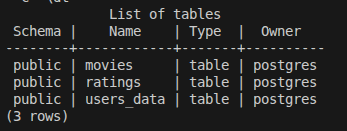
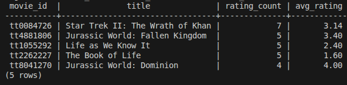
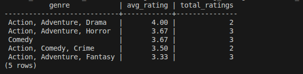

# caixa-projeto-final

## Criar tabelas no PostgreSQL Docker e importar CSV

1. Gere os CSVs:

```bash
python3 extract/extract.py
```

2. Suba o container PostgreSQL (imagem criada pelo Dockerfile):

```bash
docker run -d --name caixa-postgres \
	-e POSTGRES_DB=testdb \
	-e POSTGRES_USER=postgres \
	-e POSTGRES_PASSWORD=password \
	-p 5432:5432 \
	-v caixa_pgdata_v2:/var/lib/postgresql \
	caixa-postgres:1.0.0
```

3. Execute o script de carga:

```bash
./scripts/load_csv_to_postgres.sh caixa-postgres .
```

Esse script:
- cria as tabelas com base em `scripts/schema.sql`
- limpa dados antigos
- importa `movies.csv`, `users.csv` e `ratings.csv`
- mostra a contagem final de linhas por tabela

## Demonstração prática

- Pipeline rodando no GitHub Actions (https://github.com/Piadista/CAIXA/actions/runs/24729262959).

- Imagem publicada no Docker Hub. (https://hub.docker.com/r/guilhermess2025/my-postgres)

## Tabelas SQL



## Mais populares



## Gênereo melhor avaliação média


